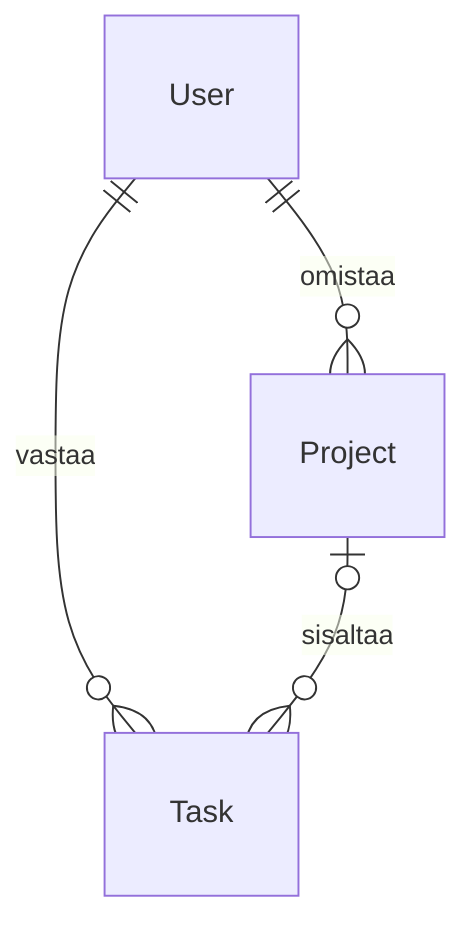

# Projektien hallinta – MVC ja Entity Framework opiskelijoille

Sovelluksessa on käyttäjien, projektien ja tehtävien lisäys, listaus, tietonäkymä,
muokkaus, poisto ja haku. Käyttöliittymä on suomeksi.

## Käynnistys

Tarvitset .NET 10 SDK:n sekä SQL Serverissä olemassa olevan TaskDb-tietokannan.
Yhteys määritellään tiedoston `ProjectManagementMVC/appsettings.json`
`ConnectionStrings:TaskDbContext`-asetuksessa. Nykyinen kehitysyhteys käyttää
Windows-tunnistautumista palvelimeen `DUUNIKONE\SQLEXPRESS`.
`TrustServerCertificate=True` sallii tämän paikallisen kehityspalvelimen varmenteen.

```powershell
dotnet build ProjectManagementMVC.slnx
dotnet run --project ProjectManagementMVC --launch-profile http
```

Avaa `http://localhost:5071`. Lisää ensin käyttäjä, sitten projekti tai tehtävä.
Tehtävän voi luoda ilman projektia. Omistaja ja vastuuhenkilö valitaan olemassa
olevista käyttäjistä; heidän yhteystietojaan ei kirjoiteta uudelleen.

## Tietomalli ja relaatiot



| Taulu | Käyttäjän syöttämät tiedot | Relaatiot |
|---|---|---|
| Users | Etunimi, sukunimi, yksilöllinen sähköposti | Käyttäjällä voi olla useita projekteja ja tehtäviä |
| Projects | Nimi, valinnainen kuvaus | Yksi pakollinen omistaja (`UserId`) |
| Tasks | Otsikko, valinnainen kuvaus, tila, prioriteetti | Pakollinen vastuuhenkilö (`UserId`), valinnainen projekti (`ProjectId`) |

Projektin omistaja ja tehtävän vastuuhenkilö voivat olla eri käyttäjiä.
Projektin omistajan vaihtaminen ei automaattisesti vaihda tehtävien vastuuhenkilöitä.

* **Pääavain**, esimerkiksi `UserId`, yksilöi rivin. SQL Server tuottaa sen lisättäessä.
* **Vierasavain**, esimerkiksi `Project.UserId`, sisältää olemassa olevan käyttäjän tunnisteen.
* **Navigaatio**, esimerkiksi `Project.User`, antaa EF:n kautta pääsyn liittyvään olioon.
  Se ei ole erillinen lomakkeessa täytettävä tieto.
* **Kokoelmanavigaatio**, esimerkiksi `User.Projects`, sisältää käyttäjän projektit.
  Uuden käyttäjän kokoelma voi aivan hyvin olla tyhjä.

Tietokannan nykyiset taulut, sarakkeet ja tiedot säilyvät. Muutos ei tarvitse
migraatiota eikä sovellus luo tai nollaa tietokantaa käynnistyessään.
`TaskOptions.cs` antaa nykyisille kokonaislukusarakkeille nimet:

| Arvo | Tehtävän tila | Prioriteetti |
|---|---|---|
| 1 | Avoin | Matala |
| 2 | Työn alla | Normaali |
| 3 | Valmis | Korkea |

Uusi tehtävä on oletuksena avoin ja sen prioriteetti on normaali.
Nämä ovat sovelluksen arvosopimukset; olemassa olevien rivien numeroita ei muuteta.

## Miksi lomakkeelle on oma malli?

`Models/User.cs`, `Project.cs` ja `Task.cs` kuvaavat tietokantaan tallennettavia olioita.
`ViewModels/UserForm.cs`, `ProjectForm.cs` ja `TaskForm.cs` kuvaavat selaimelta
vastaanotettavia kenttiä. Näiden tehtävät ovat erilaiset.

Esimerkiksi projektin lomake ottaa vastaan `Name`, `Description` ja `UserId`.
Se **ei ota vastaan** `User`-oliota, `Tasks`-kokoelmaa tai `CreatedAt`-aikaleimaa.
Siksi käyttäjän ei tarvitse syöttää relaation kautta tulevia tietoja eikä
MVC-validointi vaadi kokonaisia liittyviä olioita.

`Required`, `StringLength`, `EmailAddress` ja `EnumDataType` tarkistavat syötteet.
Pituusrajat vastaavat tietokannan sarakkeita. Selain näyttää validointiviestit,
mutta controller tarkistaa `ModelState.IsValid` myös palvelimella.
Lisäksi controller tarkistaa, että valittu käyttäjä ja projekti ovat olemassa.
Selaimen valintalistaa voi kiertää lähettämällä oman HTTP-pyynnön, joten myös tämä
tarkistus tarvitaan. Sähköpostin yksilöllisyys tarkistetaan ennen tallennusta;
tietokannan yksilöllinen indeksi suojaa myös samanaikaisilta lisäyksiltä.

## Pyynnön kulku: projektin lisääminen

1. `GET /Projects/Create` hakee käyttäjät ja näyttää `ProjectForm`-lomakkeen.
2. `<select asp-for="UserId">` näyttää nimet ja sähköpostit, mutta lähettää tunnisteen.
3. `POST /Projects/Create` vastaanottaa lomakemallin ja tarkistaa sen.
4. Controller luo `Project`-olion sallituista kentistä. `CreatedAt` asetetaan palvelimella.
5. `SaveChangesAsync()` suorittaa tietokantamuutoksen.
6. Onnistuminen ohjaa listaan. Tämä POST–Redirect–GET-malli estää lomakkeen uudelleenlähetyksen sivua päivittämällä.
7. Jos syöte on virheellinen, lomake näytetään uudelleen syötteineen ja virheilmoituksineen.
   Myös valintalistojen vaihtoehdot ladataan uudelleen, sillä selain ei lähetä niitä.

`_Fields.cshtml` on Create- ja Edit-näkymien yhteinen osanäkymä. Näin samoja
kenttiä ei tarvitse ylläpitää kahdessa paikassa. `_Details.cshtml` jakaa tiedot
tietonäkymän ja poistovahvistuksen kesken.

## Muokkaus, reititys ja aikaleimat

Reitti on `{controller}/{action}/{id?}`. Esimerkiksi `/Projects/Edit/5`
kutsuu `ProjectsController.Edit(int id)` -toimintoa arvolla 5.
Linkin `asp-route-id` ja actionin `id` käyttävät samaa nimeä.
Näkymäkansio on `Views/Projects`, koska controller on `ProjectsController`.

Muokkauksessa controller hakee olemassa olevan tietueen ja vaihtaa vain sallitut
kentät. Se ei korvaa koko tietuetta selaimesta vastaanotetulla oliolla.
Näin luontiaika ja muut lomakkeeseen kuulumattomat tiedot säilyvät.

Luontiaika täytetään kaikille kolmelle taululle automaattisesti.
Tehtävän `StatusChanged` täytetään luotaessa ja päivitetään vain tilan vaihtuessa.
Ajat käyttävät nykyisen tietokannan `sysdatetime()`-käytännön mukaisesti palvelimen
paikallista aikaa (`DateTime.Now`). Niitä ei kysytä lomakkeella.

`ValidateAntiForgeryToken` tarkistaa POST-pyynnön CSRF-tokenin. Razor-lomakkeen
Form Tag Helper lisää tarvittavan piilokentän automaattisesti.
Pelkkä poistosivun avaaminen GET-pyynnöllä ei poista mitään.

## Haut

* Käyttäjät: nimi, koko nimi tai sähköposti.
* Projektit: nimi, kuvaus tai omistajan nimi/sähköposti; lisäksi omistajasuodatin.
* Tehtävät: otsikko, kuvaus, vastuuhenkilön nimi/sähköposti tai projektin nimi;
  lisäksi vastuuhenkilö-, projekti- ja tilasuodattimet.

Hakuehdot yhdistetään: jokaisen valitun suodattimen tulee täsmätä. Tyhjä ehto ei
rajaa tuloksia. Hakuehdot näkyvät URL:ssa ja säilyvät lomakkeessa; Tyhjennä haku
palauttaa koko listan. Tekstihaku käyttää SQL Serverin tietokannan collation-asetusta
esimerkiksi isojen ja pienten kirjainten vertailussa.

LINQ rakentaa kyselyn ennen `ToListAsync()`-kutsua, joten suodatus tehdään
tietokannassa. `AsNoTracking()` sopii luettaville listoille, joita ei tallenneta.
`Include()` hakee liittyvät tiedot näyttämistä varten. Kahden kokoelman latauksessa
`AsSplitQuery()` välttää projektien ja tehtävien rivien kertautumisen keskenään.

## Poistaminen ja virhetilanteet

* Tehtävä poistetaan vahvistuksen jälkeen.
* Projektia, jolla on tehtäviä, ei poisteta suoraan. Siirrä tehtävät toiseen projektiin,
  valitse niille **Ei projektia** tai poista ne ensin.
* Käyttäjää, jolla on projekteja tai tehtäviä, ei poisteta suoraan. Vaihda niihin
  toinen omistaja/vastuuhenkilö tai poista liittyvät tiedot ensin.

Poistosivu kertoo liittyvistä tiedoista ja tarjoaa linkit suodatettuihin listoihin.
`DeleteBehavior.Restrict` ja tietokannan vierasavaimet estävät orpojen viittausten syntymisen.
Puuttuva tietue palauttaa 404-vastauksen. Jokainen controller perii suoraan
ASP.NET Coren `Controller`-luokan ja sisältää tarvitsemansa yksityiset apumetodit.
Näin toimintojen kulkua voi seurata yhdestä controller-tiedostosta. Controllerin
`TrySave()` käsittelee tallennuksen tietokantavirheet lomakeviestinä ja kirjaa
teknisen syyn lokiin.

## Testit

```powershell
dotnet test ProjectManagementMVC.slnx
```

Testit ajavat HTTP-pyyntöjä sovellusta vasten oikean SQL Serverin avulla.
Ne käyttävät aina uutta `TaskDb_CrudTests_<satunnainen tunniste>` -kantaa,
joka poistetaan testiajon päättyessä. Varsinaisen TaskDb:n tietoja ei muokata.
Testitunnuksella tulee olla oikeus luoda ja poistaa testikanta.

Palvelimen voi vaihtaa testiä varten:

```powershell
$env:TEST_SQL_CONNECTION = 'Server=OMA_PALVELIN;Integrated Security=True;TrustServerCertificate=True'
dotnet test ProjectManagementMVC.slnx
```

Testit kattavat kaikkien taulujen CRUD-ketjun, haut ja suodattimet, vapaaehtoisen
projektisuhteen, aikaleimojen säilymisen, virheelliset viittaukset, sähköpostin
yksilöllisyyden, pakolliset kentät, enum-arvot, poistosuojat, 404-vastaukset ja CSRF-suojauksen.
